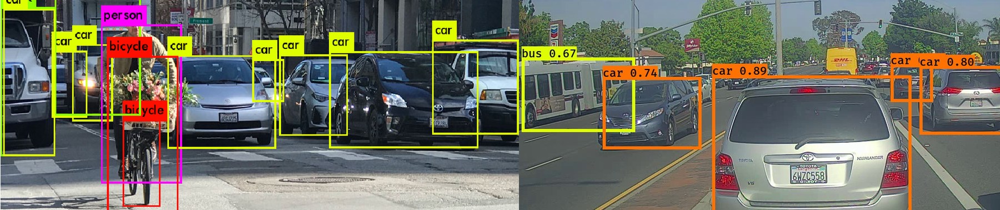

# ⚙ YOLOv5 활용 차량 객체 인식

ML Programming 교과목 프로젝트 제출용
- Kaggle 데이터셋
- Google Colab Pro
- YOLOv5

## Dataset

### [Car Object Detection](https://www.kaggle.com/datasets/sshikamaru/car-object-detection)
 
- Kaggle open dataset

| testing_images        | training_images | sample_submission.csv | train_solution_bouunding_boxes(1).csv |
| --------------------- | --------------- | --------------------- | ------------------------------------- |
| 175 files             | 1001 files      | 2.87 kB               | 34.8 kB                               |

## Models
- YOLOv5
- YOLOv5s pretrained model
### train options
- --img 67
- --batch 16
- --epochs 20
- --weights yolov5s.pt
- --name car-detection

## Accuracy
### mAP
- mAP@.5 : 0.993
- mAP@.95: 0.668
